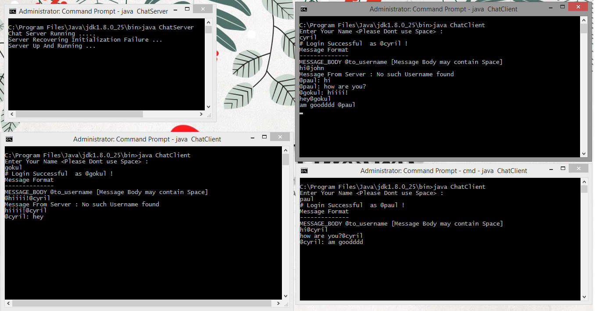

# Multi User Chat Server using TCP Socket in Java
Implementing multi user chat server using Java TCP Socket programming. 

`Created by Paul P Joby` 

### How to setup ?
- Install Java
- Place the file in Java bin file or any location as you wish
- Execute the Server Program first
```
javac ChatServer.java
java ChatServer
```
- Execute the Client Program first
```
javac ChatClient.java
java ChatClient
```
- Now run as many client programs as you wish with different username
- Message body format
```
MESSAGE_BODY @TO_USERNAME
```
### NOTE 
- There must not be no space between the '@' and username
- Dont use '@' within or at the beginning of your username while creating a client
- Only use '@' infront of username while sending a message
- Message body may or may not contain white space and other special characters except '@'

# Screenshot


### Warning
This program comes with NO WARRANTY !

### License 
Feel free to use,copy,redistribute and modify !

